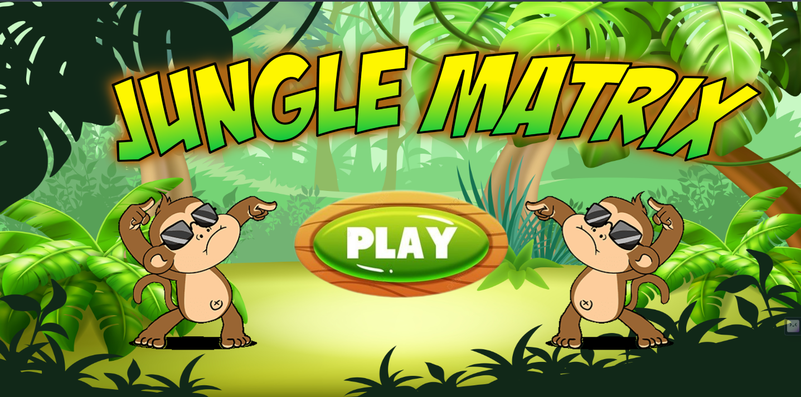
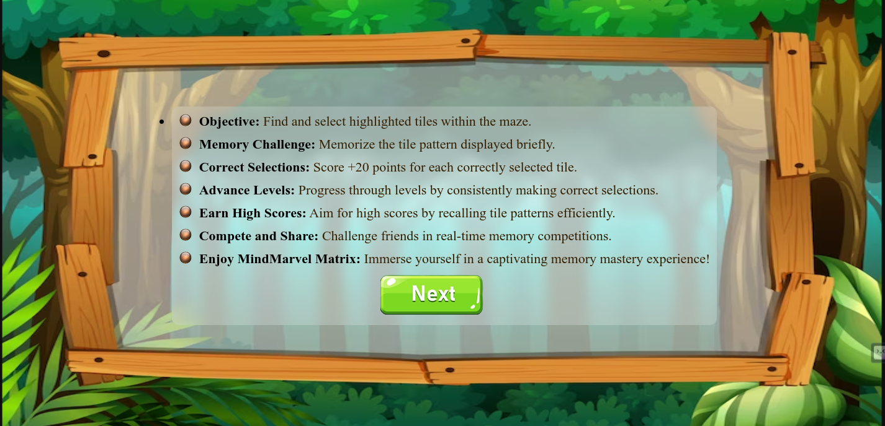
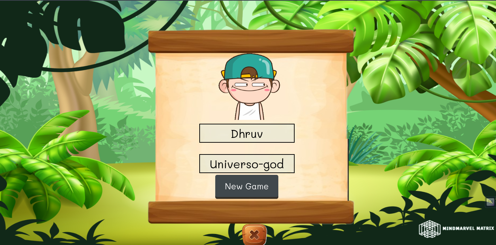
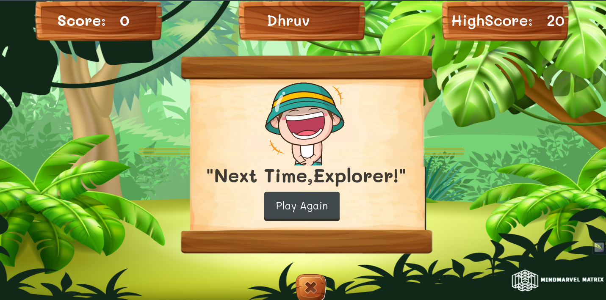

## Jungle Matrix

🌿 Welcome to the Heart of the Jungle 🌿

Welcome to the heart of the jungle! Jungle Matrix is an adventurous game that challenges your memory and rhythm. Get ready to swing through the vines, dance with the monkeys, and conquer the matrix!

## Game Description

Jungle Matrix is an HTML, CSS, and JavaScript-based game that combines action and puzzle-solving in a visually stunning jungle environment. Dive into the lush greenery, swing through the vines, and uncover the secrets that lie within the matrix.

## Screens

### 1. Home Page

Click the **Play Now** button to start your jungle adventure!

### 2. Instructions

Read the game instructions to master the jungle challenges.

### 3. Login Page

Add your username and nickname to personalize your jungle experience.

### 4. Jungle Adventure

Play the game! Remember the highlighted tiles, and watch your score grow. Your username, current score, and high score are displayed.

### 5. Level Complete

Congratulations! You've completed the level. Get ready for the next challenge!

### 6. Play Again

Want to beat your high score? Click the **Play Again** button and master the jungle matrix.

